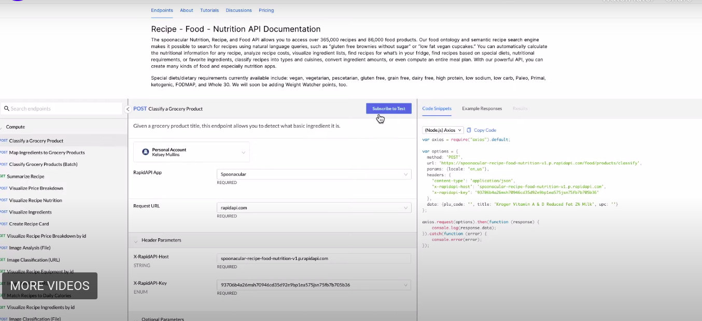

# Panduan Pendaftaran API Google Maps di Rapid API

## Langkah 1: Masuk atau Daftar ke Akun Rapid API

1. Kunjungi [Platform Rapid API](https://rapidapi.com/hub).
2. Jika Anda sudah memiliki akun, klik "Masuk" dan masukkan kredensial Anda.
3. Jika Anda belum memiliki akun, klik "Daftar" untuk membuat akun baru.

## Langkah 2: Akses Metode Pembayaran
1. Setelah masuk, arahkan ke pengaturan akun Anda. Cari bagian terkait pembayaran atau metode pembayaran.
2. Klik "Pembayaran" atau opsi serupa untuk mengakses pengaturan pembayaran Anda.
3. Jika Anda belum menambahkan metode pembayaran sebelumnya, Anda perlu melakukannya. Klik "Tambah Metode Pembayaran" atau tombol serupa.
4. Ikuti petunjuk untuk memasukkan detail pembayaran Anda. Ini mungkin mencakup informasi kartu kredit atau opsi pembayaran lainnya tergantung pada persyaratan Rapid API.

## Langkah 3: Berlangganan API Google Maps

1. Buka [Google Maps Data API di Rapid API](https://rapidapi.com/alexanderxbx/api/maps-data).
2. Di halaman API, Anda akan menemukan endpoint yang tersedia dan detail tentang API.
3. Klik tombol "Berlangganan untuk Uji" untuk endpoint yang diinginkan. 
4. Ikuti petunjuk tambahan yang diberikan oleh Rapid API untuk menyelesaikan proses langganan.

## Langkah 4: Pilih Rencana Berlangganan
1. Setelah berlangganan, Anda mungkin perlu memilih rencana berlangganan. Pilih rencana "Basic" atau rencana lain yang sesuai dengan kebutuhan Anda.
2. Tinjau detail harga dan konfirmasi langganan Anda.

## Dokumentasi Tutorial Video
Untuk panduan yang lebih rinci, lihat dokumentasi tutorial video kami tentang cara berlangganan dan mengintegrasikan API Google Maps melalui Rapid API. Video ini mencakup setiap langkah dalam proses tersebut, memudahkan Anda untuk mengikuti dan memulai dengan API di proyek Anda.

[Tonton Tutorial Video](https://youtu.be/t1lbJvoPxwM)
